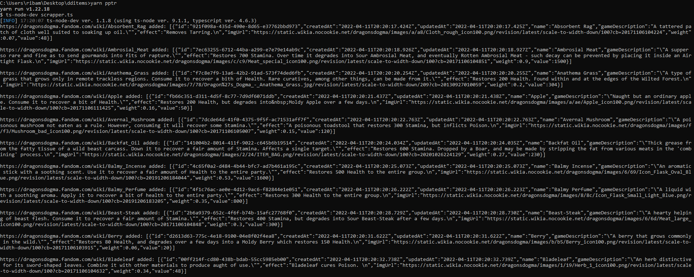
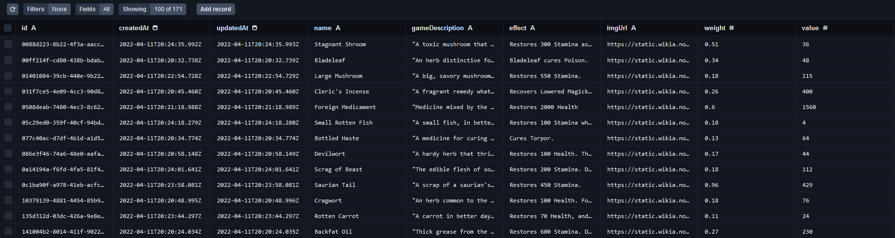

# DDItems - Create a API from Web Scrapping items

## 👀 Project Overview

- 😎 Its scraps over the Dragon's Dogma Fandom Wikia curative items and insert the items into a database. The idea is to have a API to fetch from a FrontEnd project (working...) that uses the infos on the wikia, and I didn't find an API with Dragon's Dogma items, so I build my own. (This game has pretty cool in-game items icons 😍)
- 👨‍💻 It uses Puppeteer to scraps the info from the Fandom site, and inserts each entry in a PostgreSQL DB using Prisma. Express helps to build the API queries and Prisma communicates with the DB.
- 🔗 This project isn't live. 😢

## 🔥 Techs used

<div style="
    display: inline-block
">
    
          
    
    
    
    
</div>

## 🔧 Build Setup

```bash
# Install dependencies
$ npm install # Notes that puppeteer dependency downloads a Chromium Browser, making this a bit longer process

# Custom Scripts
$ npm run dev # Run the API operation

$ npm run pptr # Run the webscrapper 

$ npm run studio # Run prisma studio

$ npm run migrate # Run the prisma migrate action

$ npm run migrate:name <name> # Run prisma migrate dev with the name flag, also you need to pass a name.

You can also use yarn!
```

## 📷 Project images
- Puppeteer in action... Cute.


- The database items after the fetching. View of Prisma Studio


## ❗ Attention

- Prisma uses a .env file with the Database URL, so remember to put one in your code, like: 

```env
DATABASE_URL="postgresql://<DB_USERNAME>:<DB_PASSWORD>@<DB_PORT>/<DB_NAME>?schema=public"
```

- This one is for WSL users like me. I use WSL2 with a Ubuntu20-04LTS distro, but the real problem is the Chromium Webdriver downloaded by puppeteer, it doesn't work with the WSL cause it's a Linux executable, so I had to run the project on my windows enviroment and it worked fine! (That's why the first image is from CMD Prompt)

- If you execute the `yarn pptr` script, you may found some errors happening, most cause the Fandom HTML tags and style of writing doesn't stay the same through the pages. I really didn't fixed the bug because the information picked it more than I needed, but in a more serious scrapper this should be taken in consideration.

## 👽 External links

- 🔗 Dragon's Dogma Fandom Wikia: https://dragonsdogma.fandom.com
- 🔗 Puppeteer page: https://pptr.dev/
- 🔗 Prisma page: https://www.prisma.io/
- 🔗 Puppeteer doesn't run under WSL (Windows subsystem for Linux) [Github Issue about my problem]: https://github.com/puppeteer/puppeteer/issues/1837